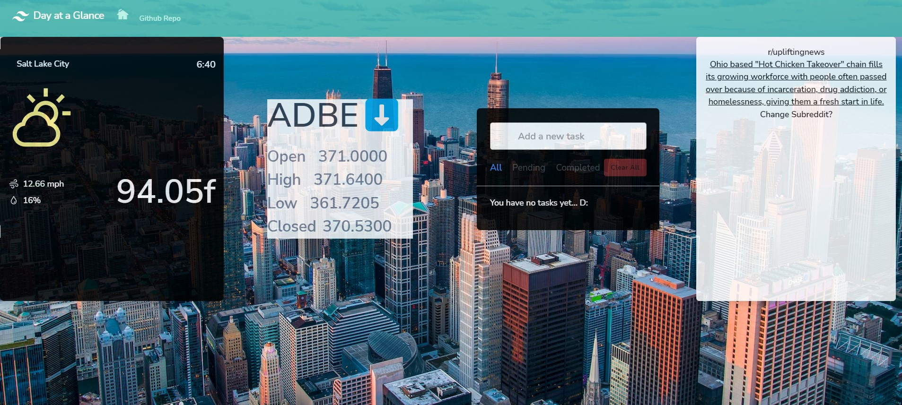

# Day-At-A-Glance

User Story
```

As A busy person
I HAVE to use multiple apps to view the information that is important to me
I WANT one app where I can see the weather forecast, stock information, reddit news headlines and a To-Do-List so that I can plan my day accordingly


```
Acceptance Criteria
```
GIVEN a dashboard with multiple selections
WHEN I open the app
THEN I am presented with current date and time, weather, stock information, news headlines and a To-Do list
WHEN I click on the options presented in the dashboard, I am taken to another page that provides additional information
THEN I am presented with the ability to: search the weather by zip code, view additional stock prices, and news headlines
WHEN I click in the to-do list section of the dashboard
THEN I am able to add items or check off items as they are completed
```


Screen of the completed home page


